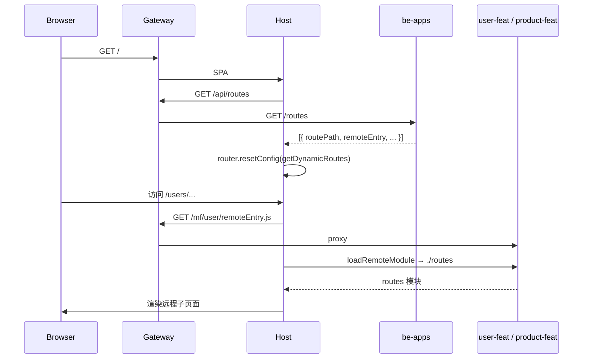

# Host 宿主应用实现说明

> 本文档说明 Sample MFE 中 **Host（宿主 Shell）** 的职责、目录结构、动态路由机制、Module Federation 配置，以及 Docker 网关接入方式。

## 1. 角色与职责

Host 是微前端体系的**唯一浏览器入口**，本身不承载业务页面，只负责：

| 职责 | 说明 |
|------|------|
| Shell 布局 | Material 顶栏 + 侧栏导航 + 主内容区 `<router-outlet />` |
| 配置驱动路由 | 启动时从后端拉取远程模块清单，运行时 `router.resetConfig` |
| 远程加载 | 通过 `loadRemoteModule` 按需加载 MF 远程；通过 `WebComponentWrapper` 加载跨版本 Web Component |
| 特性管理 | 首页控制台增删 Product 模块，演示运行时插拔 |

远程应用（`user-feat` / `product-feat` / `order-feat`）独立构建与部署；后端（`be-apps`）只做**配置中心**，不承载业务逻辑。



---

## 2. 目录结构

根路径：`fe-apps/projects/host`

```
projects/host/
├── webpack.config.js                 # Module Federation（不写死 remotes）
├── webpack.prod.config.js
├── src/
│   ├── main.ts                       # 异步 import('./bootstrap')（MF 标准入口）
│   ├── bootstrap.ts                  # 可选 MSW + bootstrapApplication
│   ├── mock.ts                       # 开发环境 MSW 模拟 /api/routes
│   ├── environments/
│   │   ├── environment.ts            # Docker / 生产（直连 /api）
│   │   └── environment.development.ts
│   └── app/
│       ├── app.component.*           # 根组件，仅 <router-outlet />
│       ├── app.config.ts             # Router + HttpClient + APP_INITIALIZER
│       ├── app.routes.ts             # 根路由 lazy load modules.routes
│       └── modules/
│           ├── modules.component.*   # Shell UI
│           ├── modules.routes.ts     # 初始路由 + getDynamicRoutes()
│           ├── models/mfe-config.ts  # CustomRemoteConfig / CustomManifest
│           ├── services/dynamic-routes.service.ts
│           └── pages/
│               ├── home/             # Feature Management
│               └── not-found/
```

在 `fe-apps/angular.json` 中，Host 使用 `@angular-builders/custom-webpack:browser`，挂载 `webpack.config.js`；本地开发端口 **4200**，`commonChunk: false`（Module Federation 常见设置）。

---

## 3. Module Federation 配置

### 3.1 Host：运行时动态 remotes

```js
// fe-apps/projects/host/webpack.config.js
const { shareAll, withModuleFederationPlugin } = require('@angular-architects/module-federation/webpack');

module.exports = withModuleFederationPlugin({
  // remotes 故意不写 —— URL 来自后端 /routes，运行时 loadRemoteModule
  shared: {
    ...shareAll({ singleton: false, strictVersion: false, requiredVersion: 'auto' }),
  },
});
```

要点：

- **不声明 `remotes`**：避免构建期写死远程地址，支持配置中心驱动。
- **`shared`**：`shareAll`，宿主侧 `singleton: false`（相对宽松）。

### 3.2 Remote 对比（user-feat / product-feat）

远程暴露粗粒度路由模块 `./routes`，并设置 `publicPath: 'auto'`，以便在网关子路径（如 `/mf/user/`）下正确解析 chunk：

```js
exposes: {
  './routes': './projects/user-feat/src/app/modules/modules.routes.ts',
}
```

### 3.3 入口链

```
main.ts  →  import('./bootstrap')
bootstrap.ts  →  (可选 MSW) + bootstrapApplication(AppComponent, appConfig)
```

---

## 4. 动态路由机制

这是 Host 最核心的实现：**路由不是写死的**，而是启动时从配置服务获取并注入 Router。

### 4.1 启动前占位路由

`modules.routes.ts` 中的初始 `routes` 只有 Shell + 404，**不含**远程模块：

```ts
export const routes: Routes = [
  {
    path: '',
    component: ModulesComponent,
    children: [
      { path: '', redirectTo: 'home', pathMatch: 'full' },
      { path: '**', component: NotFoundComponent },
    ],
  },
];
```

根路由 `app.routes.ts` 再 lazy load 上述模块路由。

### 4.2 APP_INITIALIZER 重置整套路由

```ts
// fe-apps/projects/host/src/app/app.config.ts
{
  provide: APP_INITIALIZER,
  useFactory: (dynamicRoutesService: DynamicRoutesService, router: Router) => async () => {
    await dynamicRoutesService.resetRoute(router);
  },
  deps: [DynamicRoutesService, Router],
  multi: true,
}
```

应用完成初始化前，会先拉取远程配置并调用 `router.resetConfig(...)`。

### 4.3 DynamicRoutesService

| 方法 | 作用 |
|------|------|
| `getRoutes()` | `GET /api/routes`，写入 `routesState` signal |
| `addProductRoute()` | `POST /api/routes`，后端追加 products |
| `deleteProductRoute()` | `DELETE /api/routes`，后端移除 products |
| `mapToCustomManifest()` | 数组 → `CustomManifest` |
| `resetRoute(router)` | 拉配置 → `getDynamicRoutes` → `router.resetConfig` |

API 地址：

| 环境 | `routesUrl` |
|------|-------------|
| Docker / 生产 | `${API_URL}/routes` → `/api/routes` |
| 本地 + MSW | `/api/routes`（被 MSW 拦截） |

### 4.4 getDynamicRoutes + loadRemoteModule

```ts
// fe-apps/projects/host/src/app/modules/modules.routes.ts（核心逻辑）
lazyRoutes = Object.keys(options).map((key) => {
  const entry = options[key];
  return {
    path: entry.routePath,
    loadChildren: () =>
      loadRemoteModule({
        type: entry.type,
        remoteEntry: entry.remoteEntry,
        exposedModule: entry.exposedModule,
      }).then((m) => m[entry.ngModuleName]),
  };
});
```

加载步骤：

1. 浏览器请求 `remoteEntry.js`（如 `/mf/user/remoteEntry.js`）
2. `loadRemoteModule` 拉取暴露的 `./routes`
3. `.then(m => m[entry.ngModuleName])` 取导出符号（通常为 `routes`）

最终 URL 形如：`/users/info`、`/products/product`。

### 4.5 后端配置契约（be-apps）

```http
GET    /routes   → 当前激活的远程模块列表
POST   /routes   → 追加 products（若不存在）
DELETE /routes   → 移除 products
```

单条配置示例：

```json
{
  "id": "users",
  "type": "module",
  "remoteEntry": "/mf/user/remoteEntry.js?v=1",
  "exposedModule": "./routes",
  "ngModuleName": "routes",
  "displayName": "Users",
  "routePath": "users"
}
```

Docker 中通过环境变量注入同源路径：

- `USER_REMOTE_ENTRY=/mf/user/remoteEntry.js?v=1`
- `PRODUCT_REMOTE_ENTRY=/mf/product/remoteEntry.js?v=1`

---

## 5. 配置模型

```ts
// fe-apps/projects/host/src/app/modules/models/mfe-config.ts
export type CustomRemoteConfig = RemoteConfig & {
  type: 'module';
  exposedModule: string;
  displayName: string;
  routePath: string;
  ngModuleName: string;
};

export type CustomManifest = Manifest<CustomRemoteConfig>;
```

| 字段 | 含义 |
|------|------|
| `id` | 后端业务标识（`users` / `products`），表格展示用 |
| `type` | MF 类型，固定 `'module'` |
| `remoteEntry` | `remoteEntry.js` URL |
| `exposedModule` | 远程暴露路径，如 `'./routes'` |
| `ngModuleName` | 远程导出符号，如 `'routes'` |
| `displayName` | UI 展示名 |
| `routePath` | Host 子路由 path，如 `'users'` → `/users/...` |

---

## 6. Shell UI 与 Feature Management

### 6.1 Shell（ModulesComponent）

- Material Toolbar + 固定侧栏 + 主内容区 `<router-outlet />`
- 导航项当前为写死链接：`home` / `users` / `products` / `orders`
- 未根据 `routesState` 动态生成侧栏（可改进点）

### 6.2 Feature Management（HomeComponent）

首页表格绑定 `DynamicRoutesService.routesState()`：

- **Add Product module**：`POST` → `resetRoute` → 运行时挂上 `/products`
- **Remove Product module**：`DELETE` → `resetRoute` → 卸载
- **Navigate**：跳转到对应 `routePath`

用于演示**无需重新构建 Host** 即可插拔远程模块。

### 6.3 Orders：Web Component 路径

`/orders` **不走** `loadRemoteModule` 的路由数组模式，而是使用 `@angular-architects/module-federation-tools` 的 `WebComponentWrapper`：

```ts
{
  path: 'orders',
  component: WebComponentWrapper,
  data: {
    type: 'module',
    remoteEntry: environment.ORDER_REMOTE_ENTRY + '?v=' + Math.random(),
    exposedModule: './web-components',
    elementName: 'fe-app-order-feat',
  } as WebComponentWrapperOptions,
}
```

用于演示跨 Angular 版本（Angular 16 Elements）集成。

---

## 7. Docker / Gateway 接入

### 7.1 服务关系

仅 **gateway:8080** 对外暴露；Host / Remotes / be-apps 只在 compose 网络内互通。

Host 构建参数（`docker-compose.yml`）：

- `PROJECT=host`
- `API_URL=/api`
- `ORDER_REMOTE_ENTRY=/mf/order/remoteEntry.js`

### 7.2 网关路径映射

| 浏览器路径 | 上游 | 用途 |
|------------|------|------|
| `/` | `host:80` | Host SPA |
| `/api/` | `be-apps:3000` | 动态路由 API（`/api/routes` → `/routes`） |
| `/mf/user/` | `user-feat:80` | user remoteEntry + chunks |
| `/mf/product/` | `product-feat:80` | product remoteEntry + chunks |
| `/mf/order/` | `order-feat:80` | order Web Component remote |

配置文件：`docker/gateway/nginx.conf`。

浏览器侧全部**同源**（`http://localhost:8080`），避免跨域与多端口直连。

---

## 8. 开发 vs 生产

| 项 | 本地开发 | Docker / 生产 |
|----|----------|----------------|
| Host 端口 | `4200` | 经网关 `8080` |
| 远程 | `4101` / `4102` / `4103` 直连 | `/mf/...` 同源反代 |
| API | MSW 或直连 `3000` | `/api` → be-apps |
| `USING_MOCK_API` | `true`（development） | `false` |
| 启动顺序 | 远程应先于 Host | compose `depends_on` |

本地开发可参考根目录 `readme.md`「方式二：本地开发」。

---

## 9. 关键文件索引

| 用途 | 路径 |
|------|------|
| MF Webpack | `fe-apps/projects/host/webpack.config.js` |
| 启动配置 / APP_INITIALIZER | `fe-apps/projects/host/src/app/app.config.ts` |
| 动态路由服务 | `fe-apps/projects/host/src/app/modules/services/dynamic-routes.service.ts` |
| 路由 + loadRemoteModule | `fe-apps/projects/host/src/app/modules/modules.routes.ts` |
| 类型模型 | `fe-apps/projects/host/src/app/modules/models/mfe-config.ts` |
| Shell UI | `fe-apps/projects/host/src/app/modules/modules.component.html` |
| Feature 管理 | `fe-apps/projects/host/src/app/modules/pages/home/` |
| 环境变量 | `fe-apps/projects/host/src/environments/` |
| 后端 API | `be-apps/src/index.ts` |
| Docker 编排 | `docker-compose.yml` |
| 网关 | `docker/gateway/nginx.conf` |

---

## 10. 已知注意点

1. **`resetRoute` 未返回 Promise**：内部使用 `.then()`，`APP_INITIALIZER` 的 `await` 可能在 `resetConfig` 完成前就 resolve（存在竞态风险）。
2. **`mapToCustomManifest` 对数组用 `Object.entries`**：manifest key 为 `"0"`、`"1"` 而非业务 `id`（功能仍可用，语义可改进）。
3. **侧栏导航写死**：Product 被 remove 后，侧栏「Products」链接仍在；更完善的做法是根据 `routesState` 动态渲染。

---

## 11. 一句话总结

Host 是**布局壳 + 配置驱动的路由注册器**：远程模块由后端 `/routes` 描述，运行时用 `loadRemoteModule`（或 Web Component Wrapper）挂载，无需重新构建 Host 即可插拔特性。
