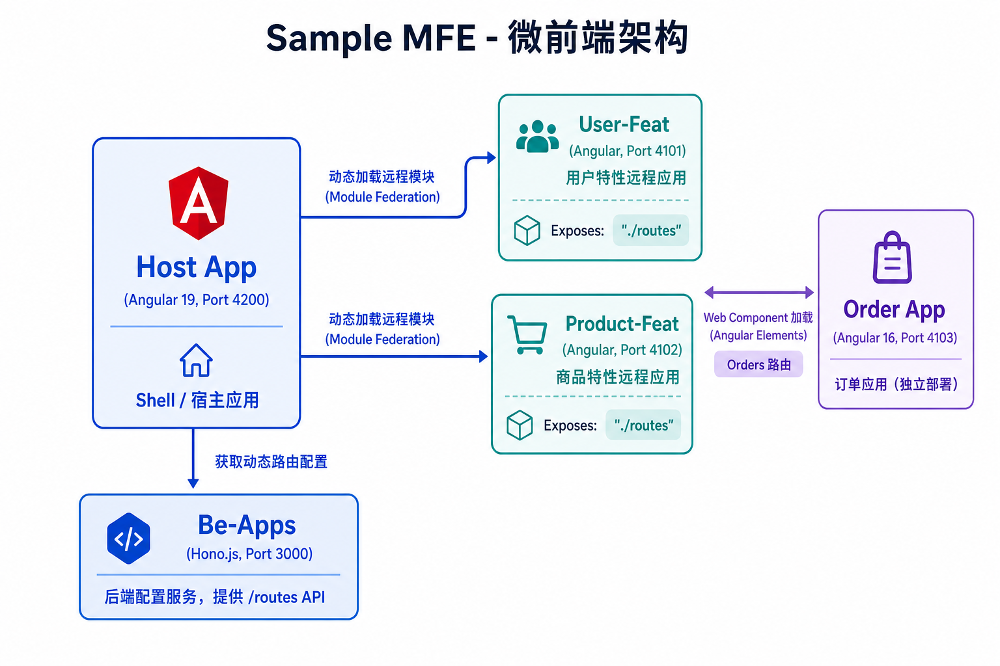
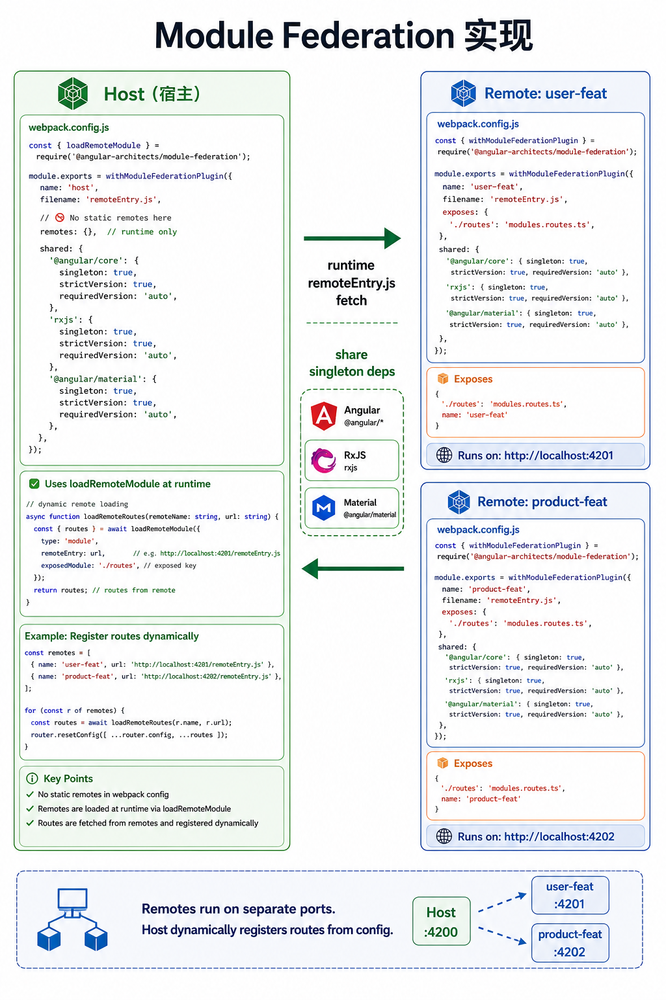
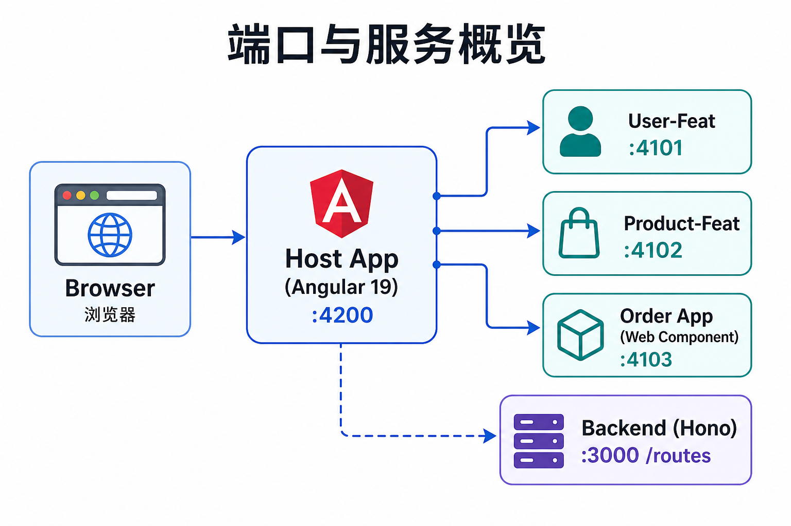
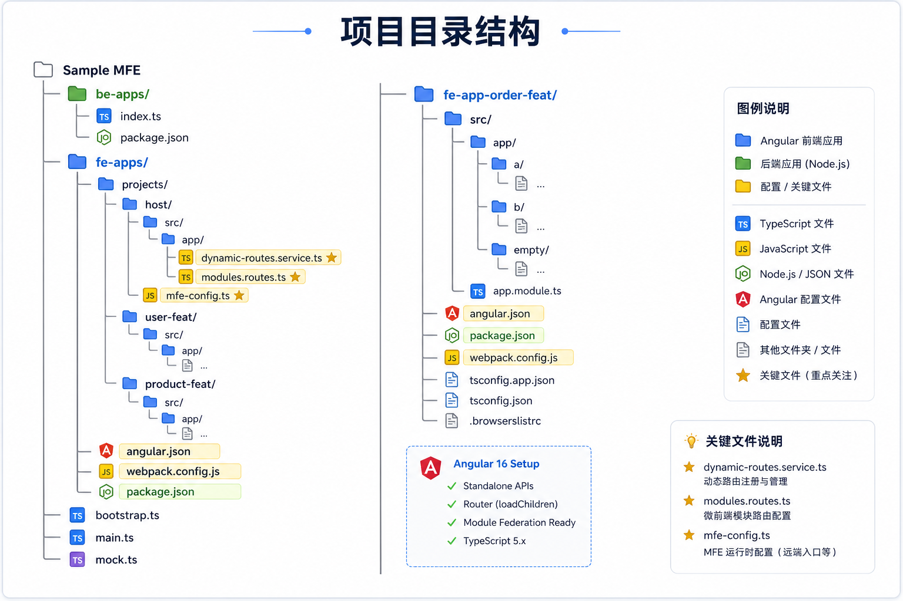
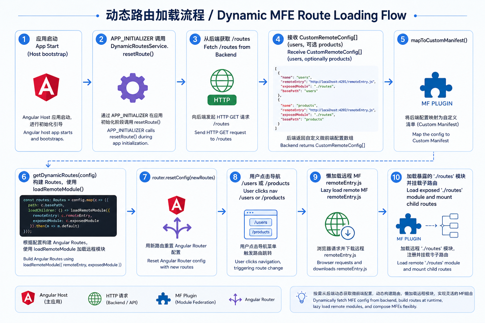
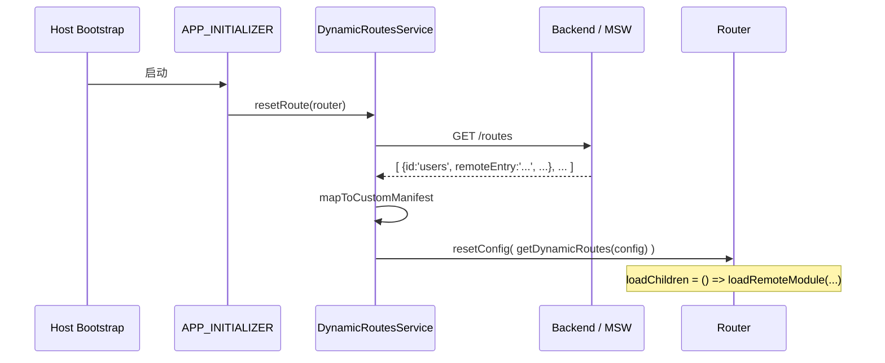

# Sample MFE - 基于 Angular Module Federation 的微前端示例

> 图文并茂的项目架构说明与实践指南

## 项目概述

本项目是一个**微前端 (Micro Frontend, MFE)** 实战示例，演示如何使用 **Angular + Webpack Module Federation** 构建可动态扩展的大型前端系统。

核心亮点：
- 宿主应用 (Host) 动态从后端拉取远程模块配置，实现**运行时插拔**特性模块
- 使用 Module Federation 实现跨应用代码共享与独立部署
- 支持 Angular 独立组件 + 传统 NgModule 混合
- 演示 Web Component 集成（跨版本 Angular 应用加载）
- 轻量后端驱动路由配置（Hono.js）
- 包含开发时 Mock (MSW)



## 什么是 Module Federation（为什么叫“联邦”）

“联邦”不是把所有前端代码合并成一个巨大应用，而是让多个**独立的应用**在遵循共同运行时协议的前提下，组合为一个用户看到的整体。

可以把它类比为联邦制：`host` 是入口和协调者；`user-feat`、`product-feat` 等 Remote 保留各自的开发、构建和发布权；它们通过 `remoteEntry.js` 声明自己可提供的能力，并在用户实际访问时才被 Host 取回和执行。



### 从“独立”到“联邦”的关系

```text
独立交付                         运行时协议                           用户体验
┌───────────────┐              ┌────────────────┐                 ┌──────────────┐
│ user-feat     │──暴露──────► │ remoteEntry.js │                 │              │
│ 独立构建/部署 │              │ ./routes       │──按需加载──────►│ Host 中的    │
└───────────────┘              └────────────────┘                 │ /users 页面 │
                                                                     │              │
┌───────────────┐              ┌────────────────┐                 │ /products 页面│
│ product-feat  │──暴露──────► │ remoteEntry.js │──按需加载──────►│              │
│ 独立构建/部署 │              │ ./routes       │                 └──────────────┘
└───────────────┘
```

它的关键含义与边界如下：

- **独立性**：每个 Remote 可独立开发、构建、部署和升级；Host 不需要在构建时把所有子应用打入自己的产物。
- **运行时组合**：Host 使用 `loadRemoteModule()` 读取 Remote 的 `remoteEntry.js`，再取得其暴露的 `./routes`，并将其注册为 Angular 懒加载路由。
- **模块级集成**：联邦交换的是路由、组件或服务等模块，不是 iframe 中的整页应用。
- **可共享依赖**：Module Federation 可协商共享 Angular、RxJS 等依赖，避免不必要的重复下载；版本兼容和单例策略需要由团队明确配置。
- **不是完全隔离**：Remote 最终仍运行在 Host 的同一浏览器页面与 JavaScript 上下文中，因此全局样式、依赖版本和跨应用状态仍需约定治理规则。

本项目将“联邦”的运行时入口进一步配置化：Host 先从 `/api/routes` 取得 Remote 地址和路由，再在用户进入 `/users`、`/products` 时加载对应模块。

### 端口与服务速览



> 提示：Cursor 预览模式下 Mermaid 代码块默认不渲染，因此这里使用图片展示，确保所有环境下都能正常查看。

---

### 目录结构图



---

## 技术栈

| 层级       | 技术                                   | 版本          | 说明                              |
|------------|----------------------------------------|---------------|-----------------------------------|
| 宿主/远程  | Angular + Standalone Components        | 19.0          | 现代 Angular 开发方式             |
| 模块联邦   | @angular-architects/module-federation  | ^18.0         | 官方推荐的 Angular MF 方案        |
| UI         | Angular Material                       | 19            | 统一设计系统                      |
| 远程(演示) | Angular + Angular Elements             | 16.2          | 演示跨版本 + Web Component 集成   |
| 后端配置   | Hono.js + @hono/node-server            | ^4            | 极简高性能边缘框架                |
| Mock       | MSW (Mock Service Worker)              | ^2            | 浏览器层 API 模拟                 |
| 构建       | Nx + Webpack (custom-webpack)          | 23            | 任务缓存 / MF 插件                |

---

## 项目目录结构

简化树状图（关键文件）：

```
sample-mfe/
├── be-apps/                    # 后端配置服务 (Hono)
│   └── src/index.ts            # 提供 GET/POST/DELETE /routes
│
├── fe-apps/                    # Angular 19 + Nx 工作区 (Monorepo)
│   ├── nx.json
│   ├── package.json
│   └── apps/
│       ├── host/               # 宿主 Shell (4200)
│       │   ├── project.json
│       │   ├── src/app/
│       │   │   ├── app.config.ts          # APP_INITIALIZER 动态路由
│       │   │   ├── modules/
│       │   │   │   ├── services/dynamic-routes.service.ts
│       │   │   │   ├── models/mfe-config.ts
│       │   │   │   ├── modules.routes.ts  # getDynamicRoutes + loadRemoteModule
│       │   │   │   └── pages/home/        # 特性管理 UI (增删远程模块)
│       │   │   └── mock.ts                # MSW 模拟后端
│       │   └── webpack.config.js
│       │
│       ├── user-feat/          # 远程 MFE - 用户特性 (4101)
│       │   ├── exposes: './routes' (info + permission)
│       │   └── ...
│       │
│       └── product-feat/       # 远程 MFE - 商品特性 (4102)
│           └── exposes: './routes' (product list)
│
└── fe-app-order-feat/          # 独立远程 - 订单 (4103)
    └── 使用 Angular Elements 暴露为 Web Component
```

---

## 架构详解

### 1. 整体运行时架构

- **Host** 作为唯一入口，负责：
  - 侧边导航
  - 动态子路由注册
  - 特性开关管理界面
- 远程应用**独立构建、独立部署**，通过 `remoteEntry.js` 暴露能力
- 后端只负责**配置中心**，不承载业务逻辑


### 2. 动态路由加载核心流程

> 更完整的 Host 实现说明（目录结构、配置模型、Docker 接入、注意点）见：[docs/host-implementation.md](docs/host-implementation.md)

这是本项目最核心的创新点：**路由不是写死的**，而是运行时从配置服务获取。



> **注意**：以上流程图为图片形式（Mermaid 源码见下文折叠区）。Cursor 预览、GitHub 等环境均可直接查看图片。

<details>
<summary>点击展开 Mermaid 源码（供需要时复制编辑）</summary>



</details>

关键代码位置：

- `apps/host/src/app/app.config.ts` — APP_INITIALIZER
- `apps/host/src/app/modules/services/dynamic-routes.service.ts`
- `apps/host/src/app/modules/modules.routes.ts` — `getDynamicRoutes()` + `loadRemoteModule()`

### 3. Module Federation 配置要点

**Host (webpack.config.js)**：

```js
// 宿主不写死 remotes！
module.exports = withModuleFederationPlugin({
  // remotes: { ... }  // 注释掉
  shared: shareAll({ singleton: false, strictVersion: false, requiredVersion: 'auto' })
});
```

**Remote (user-feat / product-feat)**：

```js
exposes: {
  './routes': './apps/xxx/src/app/modules/modules.routes.ts'
}
```

远程只暴露**粗粒度路由模块**，宿主通过 `loadRemoteModule` 按需加载。

### 4. Web Component 集成演示

`/orders` 路由使用 `@angular-architects/module-federation-tools` 的 `WebComponentWrapper` 加载 `fe-app-order-feat` 暴露的自定义元素 `<fe-app-order-feat>`。

这展示了**异构技术栈 / 跨 Angular 版本** 集成的可行性。

> 两种远程集成方式的详细对比（路由模块式 vs Web Component 式）见：[docs/remote-feats-comparison.md](docs/remote-feats-comparison.md)

---

## 特性管理（Feature Management）

Host 首页提供运行时控制台：

- 查看当前已激活的远程模块配置
- 「Add Product module」：调用后端添加 products 路由 → router.resetConfig
- 「Remove Product module」：动态移除

这模拟了**微前端的插件化 / 特性开关** 场景。

---

## 如何运行

### 方式一：Docker Compose（推荐）

前置：已安装 Docker 与 `docker compose`。

```bash
# 在仓库根目录
docker compose up --build
```

启动完成后访问：**http://localhost:8080**（仅网关对外暴露）

| 路径 | 上游服务 | 说明 |
|------|----------|------|
| `/` | `host` | 宿主 Shell |
| `/mf/user/` | `user-feat` | 用户远程 MFE |
| `/mf/product/` | `product-feat` | 商品远程 MFE |
| `/mf/order/` | `order-feat` | 订单 Web Component |
| `/api/` | `be-apps` | 动态路由配置 API |

内部服务（host / remotes / be-apps）**不映射宿主机端口**，只在 compose 网络内互通，由 `gateway` 统一反代。

停止：

```bash
docker compose down
```

说明：
- 镜像基础层使用华为云加速前缀 `swr.cn-north-4.myhuaweicloud.com/ddn-k8s/docker.io/`
- 浏览器侧使用同源路径（`/mf/...`、`/api`），避免多端口直连
- 生产构建关闭 MSW，Host 请求 `/api/routes`

### 方式二：本地开发

#### 前置要求

- Node.js >= 18
- npm

#### 步骤

##### 1. 启动后端配置服务

```bash
cd be-apps
npm install
npm run dev
# 服务运行在 http://localhost:3000
```

##### 2. 安装前端依赖

```bash
cd fe-apps
npm install
```

##### 3. 启动微前端应用

打开**多个终端**：

```bash
# 终端 1: 用户特性远程
npm run start:user     # 4101

# 终端 2: 商品特性远程
npm run start:product  # 4102

# 终端 3: 宿主应用
npm run start:host     # 4200
```

或者使用官方 MF 开发服务器（实验性）：

```bash
npm run all
```

##### 4. 启动订单 Web Component 远程（可选）

```bash
cd fe-app-order-feat
npm install
npm start   # 4103
```

访问 http://localhost:4200 即可体验。

**注意**：远程应用必须先于宿主启动，否则远程加载会失败。

---

## 常用脚本

| 命令                    | 位置         | 说明                     |
|-------------------------|--------------|--------------------------|
| `docker compose up --build` | 仓库根目录 | 一键构建并启动（网关 :8080） |
| `docker compose down`   | 仓库根目录   | 停止并移除容器           |
| `npm run start:host`    | fe-apps      | 启动宿主 4200            |
| `npm run start:user`    | fe-apps      | 启动用户特性 4101        |
| `npm run start:product` | fe-apps      | 启动商品特性 4102        |
| `npm run all`           | fe-apps      | MF 一键启动（实验）      |
| `npm run dev`           | be-apps      | 启动配置后端 3000        |

---

## 进一步学习与参考

- [Angular Architects - Module Federation](https://www.angulararchitects.io/en/blog/module-federation-with-angulars-standalone-components/)
- [Webpack Module Federation 官方文档](https://webpack.js.org/concepts/module-federation/)
- [Hono.js](https://hono.dev/)

---

## 贡献

欢迎提交 PR 改进示例、添加新远程应用、完善文档。

---

## License

MIT
